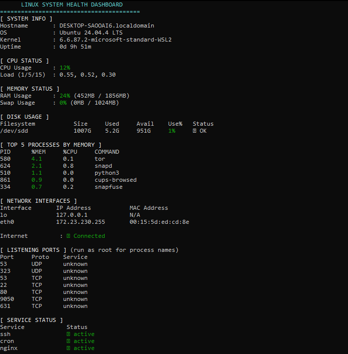

# SysInfo Health Dashboard

A single Bash script that prints a live system health overview
for Linux servers. Outputs a human-readable colour dashboard
by default and clean JSON when run with `--json`.



## Requirements

- **Linux** (tested on Ubuntu 24.04 — relies on `/proc`, `ss`, `systemctl`)
- **Bash** 4.0 or newer
- Standard utilities: `ss`, `systemctl`, `ps`, `df`, `free`,
  `ip`, `ping`, `awk`, `grep` — all pre-installed on most distributions

## How to Run

Make the script executable then launch it:

```bash
chmod +x sysinfo.sh
./sysinfo.sh
```

**JSON mode:**

```bash
./sysinfo.sh --json
```

**Validate JSON output:**

```bash
./sysinfo.sh --json | python3 -m json.tool
```
**Pretty-print with jq:**

```bash
# Pretty-print the JSON output directly
./sysinfo.sh --json | jq .
```

**Run on a schedule — add to cron:**

```bash
# Daily at 7am — append to log
0 7 * * * /path/to/sysinfo.sh >> /var/log/sysinfo.log 2>&1
```

## What I Learned

I just finished my first real Bash project and it taught me
a lot. Getting `set -euo pipefail` right forced me to write
scripts that fail early instead of silently continuing with
wrong data. Parsing output from `top`, `df`, and `ss` with
`awk` and stripping substrings with parameter expansion finally
made the man pages click. Building JSON by hand was surprisingly
tricky — a single misplaced quote or comma broke everything,
and I learned to validate with `python3 -m json.tool` constantly.
I ran the script with `bash -n` after every change to catch
syntax errors early. Along the way I hit edge cases I had not
thought of: process names disappear when not running as root,
network ports often appear twice for IPv4 and IPv6, and ANSI
color codes behave differently depending on how variables are
quoted. Each one taught me to think more defensively.
